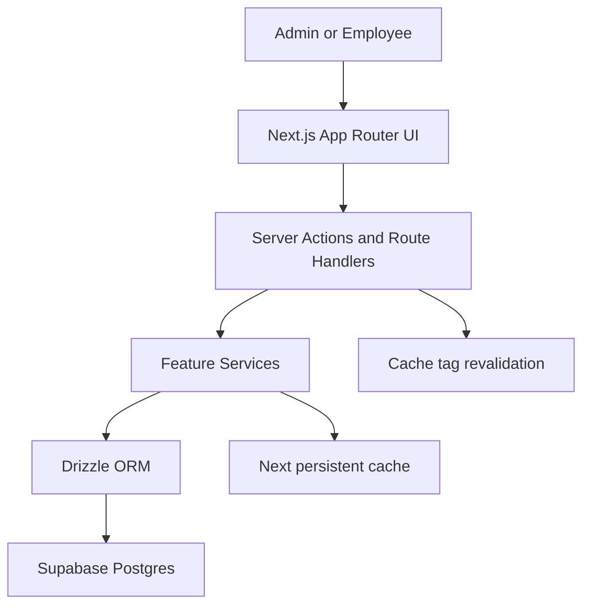
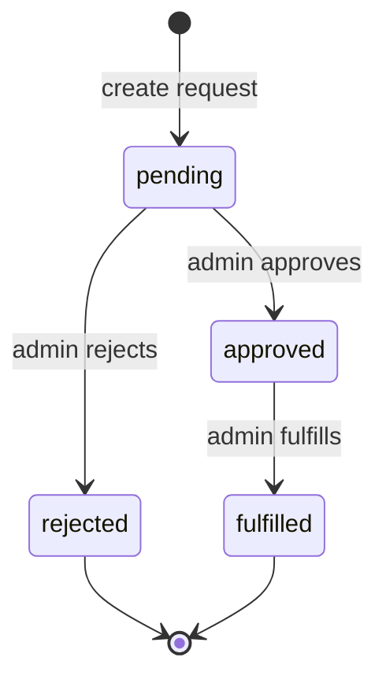

# System Design

## Architecture

The application follows a simple server-first architecture:

```text
Next.js App Router
-> Server Components / Server Actions / Route Handlers
-> Feature services
-> Drizzle ORM
-> Supabase Postgres
```

The design keeps the browser focused on UI behavior while business rules and
database mutation rules remain server-side.

## High-Level Flow



## Route Layer

The `app/` directory is kept as the route layer. Route files load the current
viewer, read search params, and render feature components.

Feature-specific UI lives under:

- `features/dashboard`
- `features/inventory`
- `features/requests`

This keeps route files thin and makes domain behavior easier to review.

## Data Model

Core tables:

- `users`
- `inventory_items`
- `inventory_requests`
- `inventory_request_items`
- `request_history`
- `audit_logs`

Supporting operational tables:

- `warehouses`
- `suppliers`
- `purchase_orders`

The request model supports multi-item requests through
`inventory_request_items`. This avoids forcing one request per item and more
closely matches real internal operations workflows.

## Request Lifecycle



Terminal statuses:

- `rejected`
- `fulfilled`

## Inventory Stock Model

Each inventory item stores:

- `quantityOnHand`
- `quantityReserved`
- `reorderPoint`

Available stock is calculated as:

```text
available = quantityOnHand - quantityReserved
```

The main table shows stock health instead of exposing the internal reorder
point. This keeps the UI useful to operators while preserving internal stock
logic.

Stock health is calculated as:

```text
internalTarget = max(reorderPoint * 2, reorderPoint + activeDemand, 1)
stockHealthPercent = clamp(round((available / internalTarget) * 100), 0, 100)
```

If `available <= 0`, stock health is always `0%`.

## Caching Model

Read-heavy pages use Next persistent cache through `cachedRead`.

Cache tags include:

- `dashboard`
- `inventory-list`
- `request-list`
- `requestable-items`
- `inventory-detail:{id}`
- `request-detail:{id}`

Mutations revalidate affected read tags. Fulfillment validation is never based
on cached data; it always re-checks stock inside the database transaction.

## Deployment Model

Runtime database access uses Supabase Postgres through Drizzle and `postgres.js`.
For Supabase transaction pooling, prepared statements are disabled with:

```ts
prepare: false;
```

The database client also uses a small pool and fail-fast timeout settings to
fit Vercel serverless behavior.

Migrations are manual release steps. They are not run automatically during
Vercel builds.
